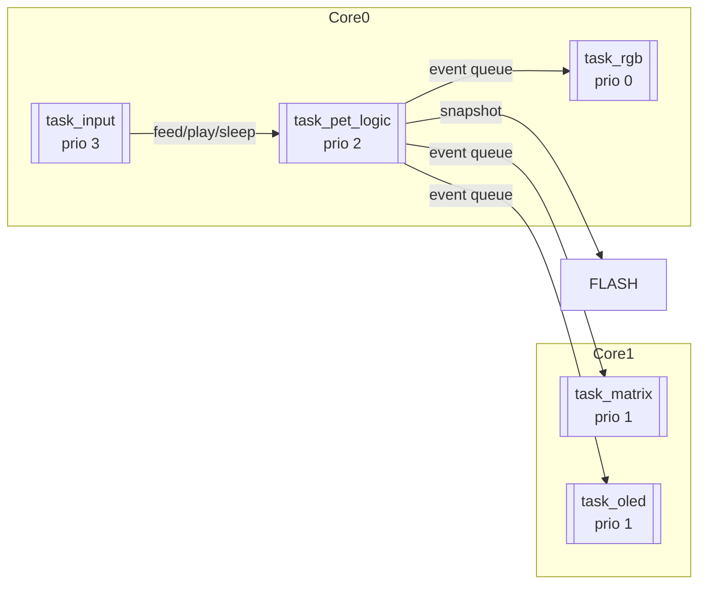

# Tarefa: Roteiro de FreeRTOS #2 - EmbarcaTech 2025

Autor: **Wagner Junior e Pedro Oliveira**

Curso: Residência Tecnológica em Sistemas Embarcados

Instituição: EmbarcaTech - HBr

Brasília, 25 de junho 2025

---

## 📝 Descrição do Projeto

Este projeto implementa um Tamagotchi virtual (Pixel Pet) para a placa BitDogLab (baseada no Raspberry Pi Pico W) utilizando o sistema operacional de tempo real FreeRTOS. O pet virtual possui atributos como fome, diversão e cansaço que mudam ao longo do tempo, simulando um animal de estimação digital que requer cuidados e atenção do usuário.

## 🏗️ Arquitetura do Sistema

### Diagrama de Tarefas e Comunicação

### Estrutura de Tarefas FreeRTOS

O sistema é composto por 5 tarefas independentes, cada uma com sua própria responsabilidade e prioridade:

1. **task_input** (Prioridade 3): Gerencia a entrada do usuário através dos botões A e B.
   - Detecta pressionamentos de botões e gera eventos correspondentes (alimentar, jogar, dormir/acordar).
   - Implementa debounce de botões com uma taxa de amostragem de 20Hz.

2. **task_pet_logic** (Prioridade 2): Implementa a lógica central do pet virtual.
   - Gerencia o estado do pet (idade, fome, diversão, cansaço, sono).
   - Gera eventos de temporização (ticks) a cada 1 segundo usando um timer periódico.
   - Processa eventos de entrada do usuário e atualiza o estado do pet.

3. **task_matrix** (Prioridade 1): Controla a matriz de LEDs WS2812 (5×5).
   - Exibe expressões faciais do pet (feliz, triste, dormindo).
   - Implementa o minigame da cobrinha (Snake) na matriz de LEDs.
   - Gerencia a atualização do estado de diversão durante o jogo.

4. **task_oled** (Prioridade 1): Gerencia o display OLED.
   - Exibe informações detalhadas sobre o estado do pet (idade, fome, diversão, cansaço, estado de sono).
   - Atualiza o display a cada segundo (em resposta aos eventos de tick).

5. **task_rgb** (Prioridade 0): Controla o LED RGB.
   - Fornece feedback visual adicional sobre o estado do pet.

### Mecanismos de Comunicação e Sincronização

O projeto utiliza vários mecanismos de comunicação e sincronização do FreeRTOS:

1. **Event Groups** (`egPet`):
   - Implementa comunicação assíncrona entre tarefas.
   - Eventos definidos: `EVT_FEED`, `EVT_PLAY`, `EVT_SLEEP`, `EVT_WAKE`, `EVT_TICK`, `EVT_SNAKE_START`.
   - Permite que múltiplas tarefas reajam aos mesmos eventos sem acoplamento direto.

2. **Semáforos Mutex** (`mtxPet`):
   - Protege o acesso concorrente à estrutura de dados compartilhada `gPet`.
   - Evita condições de corrida quando múltiplas tarefas leem ou modificam o estado do pet.

3. **Timers Periódicos**:
   - Usado na `task_pet_logic` para gerar eventos de tick a cada segundo.
   - Implementado usando a API de timers do hardware Pico com callbacks que interagem com o FreeRTOS.

## 🎮 Funcionalidades Principais

### Sistema de Pet Virtual

O pet virtual possui os seguintes atributos que mudam ao longo do tempo:

- **Idade** (`age_sec`): Aumenta a cada segundo, registrando o tempo de vida do pet.
- **Fome** (`hunger`): Escala de 0-10, aumenta gradualmente e pode ser reduzida alimentando o pet.
- **Diversão** (`fun`): Escala de 0-10, diminui com o tempo e aumenta jogando minigames.
- **Cansaço** (`tiredness`): Escala de 0-10, aumenta a cada 30 segundos e diminui durante o sono.
- **Estado de Sono** (`sleeping`): Boolean que indica se o pet está dormindo ou acordado.

### Interações do Usuário

- **Botão A**: Alimenta o pet (reduz fome para 0).
- **Botão B**: Inicia o minigame da cobrinha (aumenta diversão).
- **Botões A+B simultâneos**: Alterna entre os estados de sono e vigília.

### Minigame da Cobrinha (Snake)

- Implementado na matriz de LEDs 5×5.
- Controlado pelo joystick analógico (pinos ADC 26 e 27).
- Aumenta o nível de diversão do pet enquanto o jogo está em execução.
- Segue as regras clássicas do jogo Snake: comer maçãs para crescer, evitar colisões com paredes e com o próprio corpo.

### Sistema de Visualização

- **Matriz de LEDs WS2812**: Exibe expressões faciais do pet (feliz quando bem alimentado e entretido, triste quando com fome ou entediado, azul quando dormindo) ou o jogo Snake.
- **Display OLED**: Mostra informações detalhadas sobre o estado do pet, incluindo idade, níveis de fome, diversão, cansaço e estado de sono.
- **LED RGB**: Fornece feedback visual adicional sobre o estado do pet.

## 🔄 Uso do FreeRTOS

### Escalonamento de Tarefas

O sistema utiliza o escalonador preemptivo baseado em prioridades do FreeRTOS:

- Tarefas de maior prioridade (como `task_input`) têm precedência sobre tarefas de menor prioridade.
- A atribuição de prioridades reflete a importância relativa e os requisitos de tempo de resposta de cada tarefa.

### Gerenciamento de Recursos

- **Semáforos Mutex**: Utilizados para proteger recursos compartilhados (estrutura `gPet`).
- **Event Groups**: Implementam comunicação eficiente entre tarefas sem bloqueio desnecessário.

### Temporização

- Combinação de timers de hardware (para geração precisa de eventos periódicos) e funções de atraso do FreeRTOS (`vTaskDelay`).
- Uso de `portMAX_DELAY` para bloqueio indefinido em espera por eventos.

### Integração Hardware-Software

- Interrupções de hardware (timers) são integradas ao sistema FreeRTOS usando funções seguras para ISR (`xEventGroupSetBitsFromISR`).
- Periféricos como I2C (OLED), PIO (matriz WS2812) e ADC (joystick) são gerenciados por tarefas dedicadas.

## 🛠️ Componentes de Hardware

- **Matriz de LEDs WS2812** (5×5): Conectada ao pino 7, controlada via PIO.
- **Display OLED SSD1306**: Conectado via I2C1.
- **Botões**: Botão A e Botão B.
- **Joystick Analógico**: Eixo Y e Eixo X.
- **Sensor de Luz**: Para detecção de condições de iluminação ambiente.
- **LED RGB**: Para feedback visual adicional.

## Vídeo de apresentação do projeto
https://youtu.be/3lfrq4FYLzQ?si=J3e7ptaqZnk7wVG0
---

## 📜 Licença
GNU GPL-3.0.
